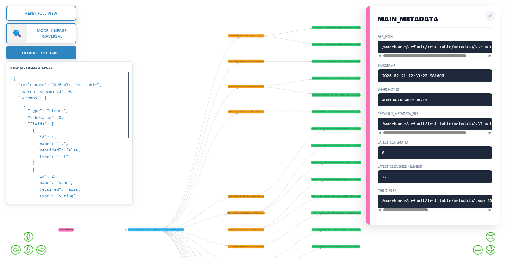
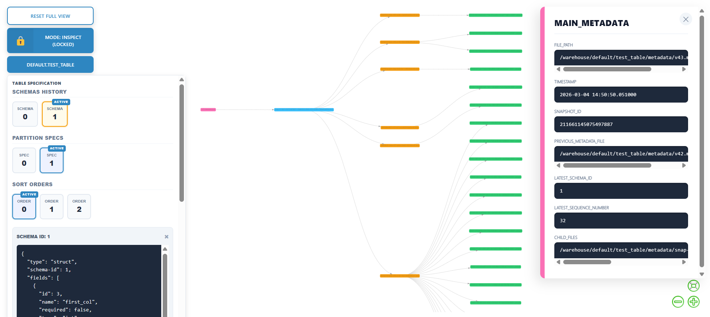

# 🧊 IceGraph

**IceGraph** provides an interactive, hierarchical view of **Apache Iceberg** metadata. It maps the DNA of your tables—from root metadata down to individual data and delete files.

> **Opinionated Design**: IceGraph is built exclusively for **Spark Connect** backends.

> **Table Version**: Currently IceGraph officially supports Table Version 2.




## 🛠 Features

* 🔒 **Read-Only**: The application is read-only and does not modify the table.
* 🕰 **Time-Travel**: View the physical state of your table as of any `datetime`.
* 🎯 **Lineage Focus**: Click a node to isolate its specific upstream and downstream path.
* 🔎 **Inspect Mode**: Toggle the **Lock View** to explore file metadata in the side panel without shifting the graph's visibility.
* 📋 **Metadata Inspector**: A sticky side panel displaying record counts, stats, and file paths.
* 🌳 **Directed Layout**: Left-to-Right (LR) flow representing the Metadata ➔ Data hierarchy.
* 🔴 **MOR Awareness**: Visual tracking of Equality and Position delete files.
* 🌴 **Branches**: View all the branches of the table, even when detached from the main branch.

> **Recommended**: In production, use a user with read-only permissions for the Spark Connect server, for extra peace of mind.

## Quick Start Using Docker

```bash
docker run -e SPARK_REMOTE=sc://<spark-connect-ip>:15002 -e TIMEZONE=my/timezone -p 5000:5000 yanivzalach/icegraph:latest
```

## Start Using Source Code




### Prerequisites

- npm
- UV (python)
- Python 3.9

### 1. Spark Connect Backend

Start your Spark Connect server (example via Docker):

```bash
cd tests/spark_connect_docker && docker-compose up -d
```

### 2. Setup

Sync the environments:

```bash
cd backend
uv sync
```

```bash
cd frontend
npm i
```

### 3. Create Mock Data

Create mock if needed for testing, from within the backend directory:
```bash
uv run python tests/create_mock_table.py
uv run python tests/create_mock_table_no_branches.py
```

### 3. Setup your Envs

We will create an `.env` file in the root of the backend directory:

```bash
TIMEZONE=my/timezone # Put your local timezone name
SPARK_REMOTE=sc://localhost:15002 # Our local testing spark, If you use docker, change it to your ip.
```

### 4. Run

Open one terminal in the backend directory and run:

```bash
uv run python main.py
```

Open a second terminal in the front end directory and run:
```bash
npm run dev
```

Go to `http://localhost:3000` and explore your mock tables.

## 📊 Node Legend

| Color | Type | Role |
| --- | --- | --- |
| 🟣 | **Metadata** | The root JSON source. The **Pink** node is the current state; others fade with age. |
| 🔵 | **Snapshot** | The Manifest List representing a specific table version. |
| 🟠 | **Manifest** | Groupings of physical data files (Avro). |
| 🟢 | **Data** | Parquet/Avro files containing actual records. |
| 🔴 | **Deletes** | MOR markers (Equality or Position delete files). |

## 🎮 UI Controls

* **Reset Full View**: Clears all filters and returns the graph to its full hierarchical state.
* **Mode: Lineage Traversal**: Default mode. Clicking a node hides everything except its direct parents and children.
* **Mode: Inspect (Locked)**: Keeps the current graph layout static. Clicking nodes updates the **Metadata Inspector** without changing visibility.
* **Table Info**: Pop-up panel showing Schema and Partition spec info of the table.
