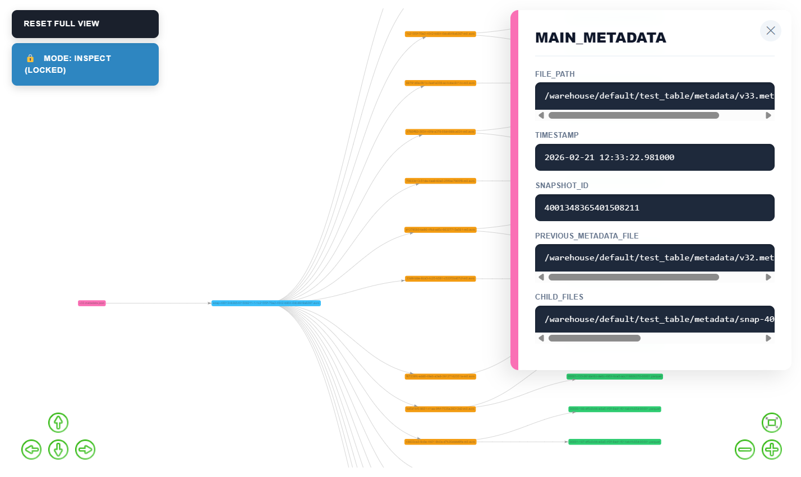

# 🧊 IceGraph

**IceGraph** provides an interactive, hierarchical view of **Apache Iceberg** metadata. It maps the DNA of your tables—from root metadata down to individual data and delete files.

> **Opinionated Design**: IceGraph is built exclusively for **Spark Connect** backends.

> **Table Version**: Currently IceGraph officially supports Table Version 2.




## 🛠 Features

* 🔒 **Read-Only**: The application is read-only and does not modify the table.
* 🕰 **Time-Travel**: View the physical state of your table as of any `datetime`.
* 🎯 **Lineage Focus**: Click a node to isolate its specific upstream and downstream path.
* 🔒 **Inspect Mode**: Toggle the **Lock View** to explore file metadata in the side panel without shifting the graph's visibility.
* 📋 **Metadata Inspector**: A sticky side panel displaying record counts, stats, and file paths.
* 🌳 **Directed Layout**: Left-to-Right (LR) flow representing the Metadata ➔ Data hierarchy.
* 🔴 **MOR Awareness**: Visual tracking of Equality and Position delete files.

## 🚦 Quick Start

### Prerequisites

- Docker
- UV (python)
- Python 3.9

### 1. Backend

Start your Spark Connect server (example via Docker):

```bash
cd tests/spark_connect_docker && docker-compose up -d
```

**Recommended**: In production, use a user with read-only permissions for the Spark Connect server, for extra peace of mind.

### 2. Setup & Mock Data

Sync the environment:
```bash
uv sync
```

Create mock if needed:
```bash
uv run python tests/create_mock_tables.py
```

### 3. Setup your Envs

We will create an `.env` file in the root directory of icegraph:

```bash
TIMEZONE=My timezone
SPARK_REMOTE=sc://localhost:15002 # Our local testing spark
APPLICATION_PORT=5000
```

### 4. Run

```bash
uv run python icegraph/main.py
```

Go to `http://localhost:5000` and explore your mock tables.

## 📊 Node Legend

| Color | Type | Role |
| --- | --- | --- |
| 🟣 | **Metadata** | The root JSON source. The **Pink** node is the current state; others fade with age. |
| 🔵 | **Snapshot** | The Manifest List representing a specific table version. |
| 🟠 | **Manifest** | Groupings of physical data files (Avro). |
| 🟢 | **Data** | Parquet/Avro files containing actual records. |
| 🔴 | **Deletes** | MOR markers (Equality or Position delete files). |

## 🎮 UI Controls

* **Reset Full View**: Clears all filters and returns the graph to its full hierarchical state.
* **Mode: Lineage Traversal**: Default mode. Clicking a node hides everything except its direct parents and children.
* **Mode: Inspect (Locked)**: Keeps the current graph layout static. Clicking nodes updates the **Metadata Inspector** without changing visibility.
* **Table Info**: Pop-up panel showing Schema and Partition spec info of the table.
